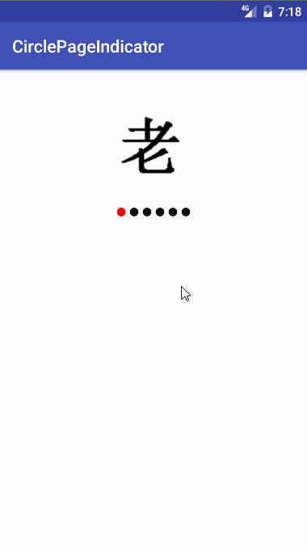
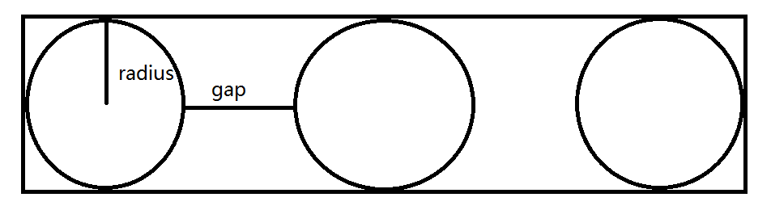

# 简介 #

一个简单的ViewPager圆点指示器自定义控件示例

# 1. 初始化ViewPager #
在MainActivity中调用initView方法初始化ViewPager。

    private void initView() {
        mViewPager = (ViewPager) findViewById(R.id.vp);
        mViewPager.setAdapter(mPagerAdapter);
    }

    private PagerAdapter mPagerAdapter = new PagerAdapter() {
        @Override
        public int getCount() {
            return mDataList.length;
        }

        @Override
        public boolean isViewFromObject(View view, Object object) {
            return view == object;
        }

        @Override
        public Object instantiateItem(ViewGroup container, int position) {
            ImageView imageView = new ImageView(MainActivity.this);
            imageView.setImageResource(mDataList[position]);
            container.addView(imageView);
            return imageView;
        }

        @Override
        public void destroyItem(ViewGroup container, int position, Object object) {
            container.removeView((View) object);
        }
    };

# 2. 创建CirclePagerIndicator #
	public class CirclePageIndicator extends View {
	
	    public CirclePageIndicator(Context context) {
	        this(context, null);
	    }
	
	    public CirclePageIndicator(Context context, @Nullable AttributeSet attrs) {
	        super(context, attrs);
	        init();
	    }
	}
	
	//将自定义控件CirclePageIndicator放入布局中
	<?xml version="1.0" encoding="utf-8"?>
	<RelativeLayout
	    xmlns:android="http://schemas.android.com/apk/res/android"
	    xmlns:app="http://schemas.android.com/apk/res-auto"
	    xmlns:tools="http://schemas.android.com/tools"
	    android:layout_width="match_parent"
	    android:layout_height="180dp"
	    tools:context="com.itheima.circlepageindicator.MainActivity">
	
	    <android.support.v4.view.ViewPager
	        android:id="@+id/vp"
	        android:layout_width="match_parent"
	        android:layout_height="180dp"/>
	
	    <com.itheima.circlepageindicator.CirclePageIndicator
	        android:id="@+id/indicator"
	        android:layout_width="200dp"
	        android:layout_height="20dp"
	        android:layout_alignParentBottom="true"
	        android:layout_marginBottom="10dp"
	        android:layout_centerHorizontal="true"/>
	</RelativeLayout>

# 3. 关联ViewPager #

    private void initView() {
        mViewPager = (ViewPager) findViewById(R.id.vp);
        mViewPager.setAdapter(mPagerAdapter);
        mCirclePageIndicator = (CirclePageIndicator) findViewById(R.id.indicator);
        mCirclePageIndicator.setViewPager(mViewPager);
    }

# 4. CirclePageIndicator测量 #

    //点的半径
    private int mDotRadius = (int) TypedValue.applyDimension(TypedValue.COMPLEX_UNIT_DIP, 10, getResources().getDisplayMetrics());
    //点与点的间隔
    private int mDotGap = (int) TypedValue.applyDimension(TypedValue.COMPLEX_UNIT_DIP, 10, getResources().getDisplayMetrics());

    @Override
    protected void onMeasure(int widthMeasureSpec, int heightMeasureSpec) {
        int count = mViewPager.getAdapter().getCount();
        int width =  2 * mDotRadius * count + (count - 1) * mDotGap;
        int height = 2 * mDotRadius;
        setMeasuredDimension(width, height);
    }

# 5. 绘制不动点 #
    @Override
    protected void onDraw(Canvas canvas) {
        //点与点之间圆心的距离
        int dotDistance = mDotGap + 2 *  mDotRadius;
        //循环遍历不动点
        for (int i = 0; i < mViewPager.getAdapter().getCount(); i++) {
            float cx = mDotRadius + i * dotDistance;
            float cy = mDotRadius;
            mDotPaint.setColor(Color.WHITE);
            canvas.drawCircle(cx, cy, mDotRadius, mDotPaint);
        }
    }

# 6. 绘制动点 #
## 获取ViewPager滚动的位置和滚动的比例 ##
    private ViewPager.OnPageChangeListener mOnPageChangeListener = new ViewPager.OnPageChangeListener() {

        @Override
        public void onPageScrolled(int position, float positionOffset, int positionOffsetPixels) {
            mPosition = position;
            mPositionOffset = positionOffset;
            invalidate();
        }

        @Override
        public void onPageSelected(int position) {

        }

        @Override
        public void onPageScrollStateChanged(int state) {

        }
    };

## 计算出动点位置并绘制 ##
    @Override
    protected void onDraw(Canvas canvas) {
		........
        //绘制动点
        mDotPaint.setColor(Color.RED);
        float mMoveCx = mDotRadius + mPosition * dotDistance + dotDistance * mPositionOffset;
        float mMoveCy = mDotRadius;
        canvas.drawCircle(mMoveCx, mMoveCy, mDotRadius, mDotPaint);
    }